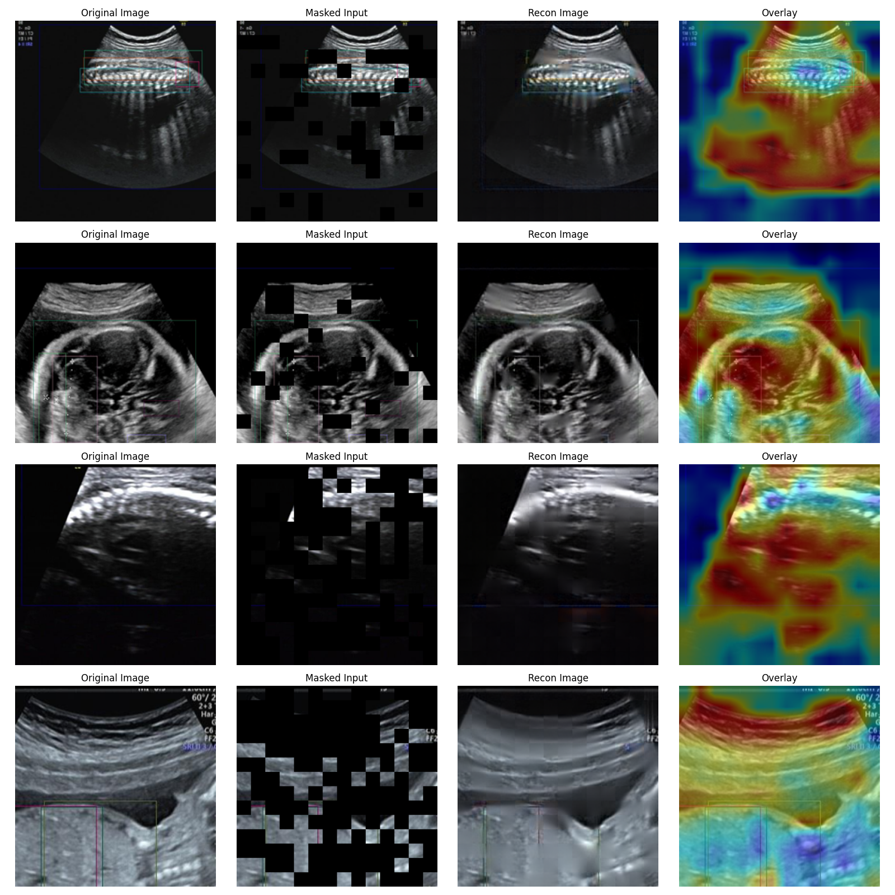
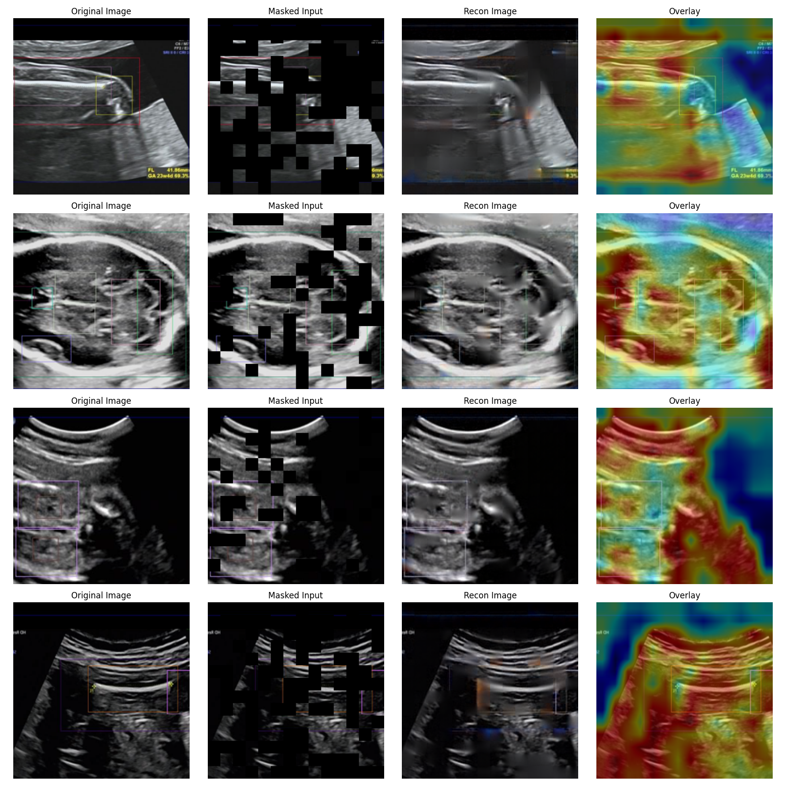
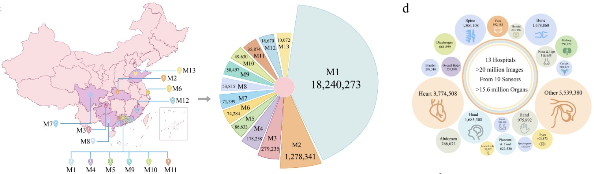
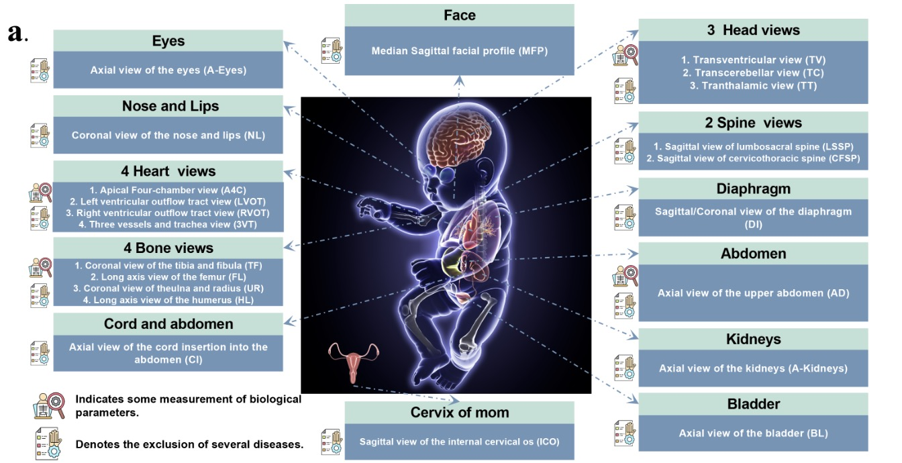
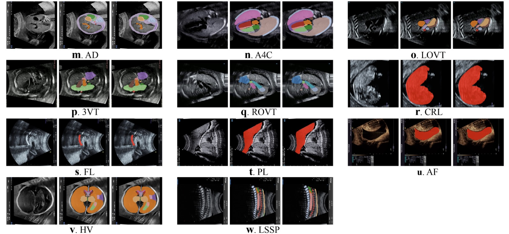
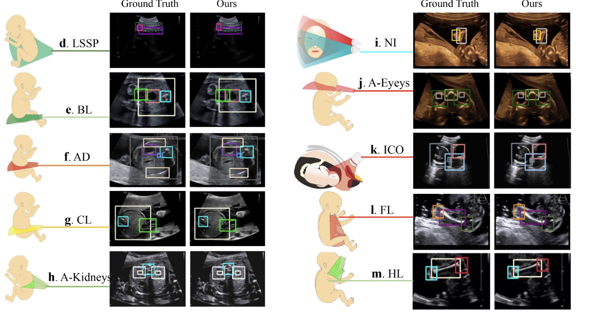
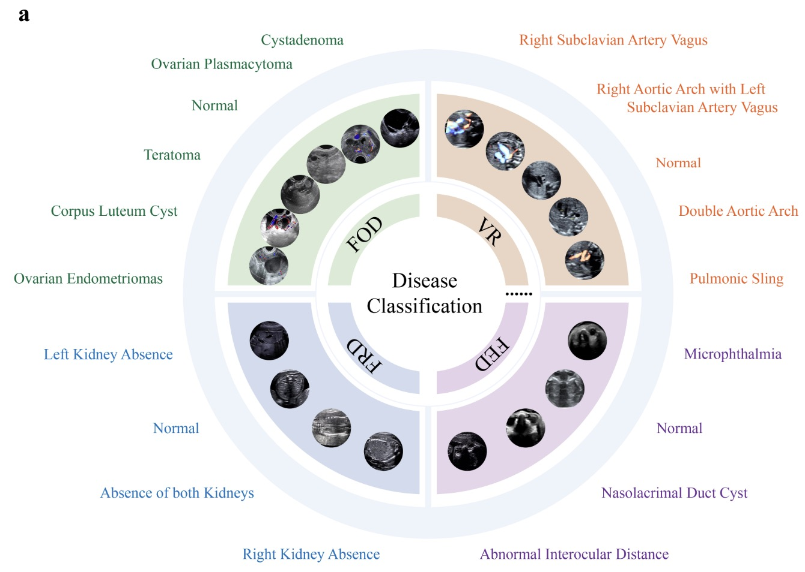

<div style="display: flex; align-items: center; justify-content: center;">
  <!---->
  <h1 style="margin: 0; text-align: left;">
    SonoNexus: A Universal Foundation Model for Sensor-Agnostic Ultrasound Imaging
  </h1>
</div>


## 🔥 News
- **[2025-11]** Setup the GitHub project of SonoNexus!!!

## 📖 Overview

**Hulu-Med** SonoNexus is a foundation model-powered sensing system that acts as a **hardware-agnostic Rosetta Stone** for interpreting images across the entire sensor landscape. It is built upon two cornerstone contributions. First, we construct **Sono-21M**, the largest and most diverse ultrasound dataset to date, comprising 21.14 million images of 20 major organ types. Purposefully curated from 10 distinct mainstream sensor models across 17 hospitals. Second, we developed SonoNexus via a self-supervised learning strategy, enabling seamless performance across a broad spectrum of devices and downstream clinical applications.

<div align="center">

</div>


## 📊 Pre-Training towards Unified Representation for US Imaging

Here, we provide the inference codes to show the effectivenss of the [pre-trained models](https://drive.google.com/drive/folders/1Ff7fdXIGN9nsWqf9la0Tc7kYRKxFds04?usp=drive_link) on reconstructing the masked US images and capturing the discriminative features.
<div align="center", style="display: flex; justify-content: center;">
  
  
</div>

Detailed feature visualization and image inference codes are define in test_model.py. To calculate the activation maps, we provide two query anchors, including max-pooled token and average-pooled token among patch tokens.

```Python
import torch
import torch.nn.functional as F
from load_model import VisionUlt
import os
import matplotlib.pyplot as plt
import numpy as np
import cv2
from dataset import get_data

# Set device
os.environ['CUDA_VISIBLE_DEVICES'] = "0"
device = torch.device("cuda" if torch.cuda.is_available() else "cpu")

# ==========================================
# 1. Helper Functions
# ==========================================

def denormalize(img_tensor):
    """
    Convert an ImageNet-standardized tensor back to a 0-255 numpy array (H, W, C)
    """
    mean = torch.tensor([0.485, 0.456, 0.406]).view(3, 1, 1).to(img_tensor.device)
    std = torch.tensor([0.229, 0.224, 0.225]).view(3, 1, 1).to(img_tensor.device)
    
    img = img_tensor * std + mean
    img = torch.clamp(img, 0, 1)
    img = img.permute(1, 2, 0).cpu().detach().numpy()
    return (img * 255).astype(np.uint8)

def compute_similarity_heatmap(feats, img_size, pool_type='avg'):
    """
    Compute a cosine similarity heatmap between feature maps and global features
    
    Args:
        feats: [B, H, W, C] Input features
        img_size: (Target_H, Target_W) Original image size
        pool_type: 'avg' (average pooling) or 'max' (max pooling)
    """
    B, H, W, C = feats.shape
    
    # 1. Compute global feature vector
    # Perform pooling on spatial dimensions (H, W), i.e., dimensions 1 and 2
    if pool_type == 'avg':
        # [B, H, W, C] -> [B, 1, 1, C]
        global_feat = feats.mean(dim=(1, 2), keepdim=True)
    elif pool_type == 'max':
        # [B, H, W, C] -> [B, C] -> [B, 1, 1, C]
        # torch.amax supports multi-dimension max
        global_feat = torch.amax(feats, dim=(1, 2), keepdim=True)
    else:
        raise ValueError("pool_type must be 'avg' or 'max'")
        
    # 2. Compute cosine similarity
    # feats:       [B, H, W, C]
    # global_feat: [B, 1, 1, C]
    # F.cosine_similarity automatically broadcasts and computes along dim=-1 (channel)
    similarity_map = F.cosine_similarity(feats, global_feat, dim=-1) # Result: [B, H, W]
    
    # 3. Upsample to original image size
    # Interpolation requires [B, C, H, W] format, where C=1
    similarity_map = similarity_map.unsqueeze(1) # [B, 1, H, W]
    similarity_map = F.interpolate(similarity_map, size=img_size, mode='bilinear', align_corners=False)
    similarity_map = similarity_map.squeeze(1)   # [B, Target_H, Target_W]
    
    return similarity_map

def apply_heatmap_overlay(img_rgb, heatmap_tensor):
    """
    Overlay a heatmap on the original image
    """
    # Convert to numpy
    heatmap_np = heatmap_tensor.cpu().detach().numpy()
    
    # Normalize (Min-Max) to 0-1
    # Cosine similarity range is typically [-1, 1], so we map it to the visualization range
    heatmap_np = heatmap_np - np.min(heatmap_np)
    heatmap_np = heatmap_np / (np.max(heatmap_np) + 1e-8)
    
    # Convert to pseudo-color
    heatmap_uint8 = (heatmap_np * 255).astype(np.uint8)
    heatmap_color = cv2.applyColorMap(heatmap_uint8, cv2.COLORMAP_JET)
    heatmap_color = cv2.cvtColor(heatmap_color, cv2.COLOR_BGR2RGB)
    
    # Overlay
    overlay = cv2.addWeighted(img_rgb, 0.6, heatmap_color, 0.4, 0)
    
    return heatmap_color, overlay

# ==========================================
# 2. Model Loading
# ==========================================

path = "your_downloaded_pth_file"

model = VisionUlt().to(device)
checkpoint = torch.load(path, map_location=device)
state_dict = {k.replace("module.", ""): v for k, v in checkpoint.items()}
model.load_state_dict(state_dict, strict=False)
model.eval()

print("Model loaded successfully.")

dataloader = get_data(data_root="your_test_images", batch_size=4)

# ==========================================
# 3. Main Loop and Visualization
# ==========================================

for data in dataloader:
    image, mask, _ = data
    image = image.to(device)
    mask = mask.to(device)
    
    # Inference
    with torch.no_grad():
        image_recon = model(image, mask)
        # Get features: [B, H, W, C]
        feats = model.model(image * (1 - mask))[3]
        feats = model.merge(feats)
    
    print(f"Feats shape: {feats.shape}") 

    mse = ((image_recon - image) ** 2).mean()
    print(f"mse is {mse}")

    # Prepare data for visualization
    batch_size = image.shape[0]
    img_h, img_w = image.shape[2], image.shape[3]
    
    # --- Core modification: compute similarity heatmap ---
    # You can choose pool_type='avg' or 'max'
    heatmaps_resized = compute_similarity_heatmap(feats, (img_h, img_w), pool_type='max')
    
    # Create canvas
    fig, axs = plt.subplots(batch_size, 4, figsize=(16, 4 * batch_size))
    if batch_size == 1: axs = axs[None, :]
    
    for i in range(batch_size):
        # 1. Original Image
        img_orig = denormalize(image[i])
        img_recon = denormalize(image_recon[i])
        
        # 2. Masked Image
        mask_np = mask[i].permute(1, 2, 0).cpu().detach().numpy()
        img_masked = img_orig * (1 - mask_np)
        img_masked = img_masked.astype(np.uint8)
        
        # 3. Similarity Heatmap & Overlay
        heatmap_vis, overlay_vis = apply_heatmap_overlay(img_orig, heatmaps_resized[i])
        
        # --- Plot ---
        axs[i, 0].imshow(img_orig)
        axs[i, 0].set_title("Original Image")
        axs[i, 0].axis('off')
        
        axs[i, 1].imshow(img_masked)
        axs[i, 1].set_title("Masked Input")
        axs[i, 1].axis('off')
        
        axs[i, 2].imshow(img_recon)
        axs[i, 2].set_title("Recon Image")
        axs[i, 2].axis('off')
        
        axs[i, 3].imshow(overlay_vis)
        axs[i, 3].set_title("Overlay")
        axs[i, 3].axis('off')

    plt.tight_layout()
    save_path = "visualization_similarity.png"
    plt.savefig(save_path)
    print(f"Visualization saved to {save_path}")
    
    break
```


**If ones are willing to pre-train SonoNexus on in-house datasets, please refer**:

### 1. Data Preparation

  <div align="center">
  
  </div>

The training and testing datasets are defined in ./dataset_mae_cnn.py, with the data pre-processing augmentation pipeline and masking strategy.
Our in-house pre-trained data consists of a large-scale dataset of **21,140,761** covering **20
major organs**, enabling comprehensive model training and evaluation, collected from 10 types of ultrasound equipment/sensors.

### 2. Model Architecture

The model is in ./model/swin.py, including the model definition, masked image reconstruction loss and contrastive loss.

### 3. Training Pipeline

The training process is in ./train_mae_cnn.py and the running file is ./main_mae_cnn.py


## 📋 Supported Tasks

- ✅ Fetal ultrasound view classification
  <div align="center">
  
  </div>
- ✅ Organ segmentation
  <div align="center">
  
  </div>
- ✅ Anatomical structure detection
  <div align="center">
  
  </div>
- ✅ Disease classification
  <div align="center">
  
  </div>

When pre-trained period is finised, ones can easily transfer the model into diverse down-stream tasks for US images. In the main paper, we focus on four tasks, inclduing fetal ultrasound view classification, organ segmentation, anatomical structure detection and disease classification.


## 📜 License

This project is released under the [Apache 2.0 License](LICENSE).

---
